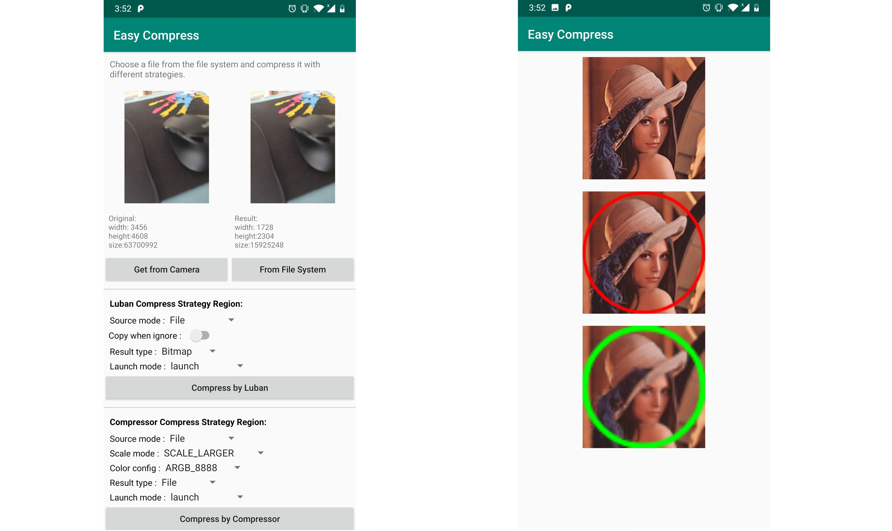

<h1 align="center">An easy to use image compress library for Android</h1>

<p align="center">
  <a href="http://www.apache.org/licenses/LICENSE-2.0">
    
  </a>
  <a href="https://bintray.com/beta/#/easymark/Android/compressor?tab=overview">
    
  </a>
  <a href="https://www.codacy.com/manual/Shouheng88/Compressor?utm_source=github.com&amp;utm_medium=referral&amp;utm_content=Shouheng88/Compressor&amp;utm_campaign=Badge_Grade">
    
  </a>
  <a href="https://www.travis-ci.org/Shouheng88/Compressor">
    
  </a>
    <a href="https://developer.android.com/about/versions/android-4.2.html">
    
  </a>
   <a href="https://github.com/Shouheng88">
    
  </a>
  <a target="_blank" href="https://shang.qq.com/wpa/qunwpa?idkey=2711a5fa2e3ecfbaae34bd2cf2c98a5b25dd7d5cc56a3928abee84ae7a984253">
    
  </a>
</p>

<p align="center">
    <a href="./README-zh.md">中文版</a>
</p>

## 1 Introduction

This project is mainly designed based on the Android image compress API. It provided two image compress implementions based on algorithms of open souce libraries  [Luban](https://github.com/Curzibn/Luban) and [Compressor](https://github.com/zetbaitsu/Compressor) and introduced interfaces for different types of image sources and results. It provided sync and async API to meet more requirements. And it put forward the struture so that you can easily switch from different compress algorithms.

## 2 Functions and features

Now lets show you the functions and features of our library:

- **Support Luban Algorithm**: As mentationed, it provided an algorithm based on WeChat.

- **Support Compressor Algoruthm**: Differenct from Luban, you are able to get an exact image size.

- **Support RxJava callback**: We will return a Flowable object so you can use it as RxJava.

- **Support AsyncTask callback**: Except RxJava, you can also use AsyncTask to run background task, and get the result in main thread from callback.

- **Support kotlin coroutines**: Also, you can use the library in kotlin coroutines.

- **Support synchronous APIs**

- **Support to stretch images by width/height/longer side/smaller side**

- **Support 3 image sources types**: Most of the liraries, the required image type was File. But when we got the image data from camera APIs, it turn out to be byte array. So in other libraries, you have to transfer data from byte array to File. That means you have to write data to file system, witch no doubt may lower the performance of your App.. Currently, our library support image source types include File, byte array, file path and Bitmap.

- **Support 2 image result types**: Sometimes, when we got the compressed result, we have to process it later. In Android, we use Bitmap. In this circumstance, it's better to get Bitmap than File. So, to meet this requirement, we provided result type of Bitmap.

- **Provided custom interfaces**: Except algorithms above, we also provided user custom interfaces. We built an structure so that user can easily and conveniently switch from different strategys.

- **More**: To get more features and functions about this library, you can install our sample [APK](resources/app-debug.apk) to get more informations.

[<div align="center"></div>](resources/app-debug.apk)

## 3 Usage

### 3.1 Introduce our library in Gradle

It's convenient to use our lirary in your project. 

First, add  jcenter repository in your project:

```gradle
repositories { jcenter() }
```

Then, add our library in your dependency:

```gradle
implementation 'me.shouheng.compressor:compressor:latest-version'
```

### 3.2 Use our library

First, you should use the static methods of Compress to get a an instance of it, which is the magic begins. It has three different factory methods correspond to three different type of image sources:

```kotlin
// Factory 1: Use File to get Compress instance
val compress = Compress.with(this, file)

// Factory 2: Use byte array to get Compress instance
val compress = Compress.with(this, byteArray)

// Factory 3: Use Bitmap to get Compress instance
val compress = Compress.with(this, bitmap)
```

Then, you can call methods of `compress` instance to config basic image options. Basic options are those used in all strategies. That's why you can easily switch from different algorithms.

```kotlin
compress
    // Sepcify image quality
    .setQuality(60)
    // Specify output directory
    .setTargetDir(PathUtils.getExternalPicturesPath())
    // Specify callback of result
    .setCompressListener(object : CompressListener {
        override fun onStart() {
            // callback when compress start
        }

        override fun onSuccess(result: File?) {
            // callback when compress succeed
        }

        override fun onError(throwable: Throwable?) {
            // callback when compress error
        }
    })
```

Then we need to specify compress strategy (algorithm). Take Compressor strategy as an example, we could use `Strategies.compressor()` to get instance of this strategy. And config details about this strategy by `setMaxHeight`, `setMaxWidth` etc. Different algorithm might have different configurations. For details, you can refer to the comment of methods. Also, for keypoints, your can refer to 3.3 of this README.

```kotlin
val compressor = compress
    // Specify strategy
    .strategy(Strategies.compressor())
    // Set desired output width and height
    .setMaxHeight(100f)
    .setMaxWidth(100f)
    // Set desiged output scale mode
    .setScaleMode(scaleMode)
```

Next, as mentioned above, if you want to get compressed image of Bitmap. You should use `asBitmap()` of `compressor`. Otherwise, the compressed result will be File type.

```kotlin
compressor = compressor.asBitmap()
```

To finally get the result you have 4 options correspond to 4 different ways async/sync api:

```kotlin
// Option 1: use AsyncTask to execute async task and to get result from callback
compressor.launch()

// Option 2: use Flowable and RxJava to get result
val d = compressor
    .asFlowable()
    .subscribeOn(Schedulers.io())
    .observeOn(AndroidSchedulers.mainThread())
    .subscribe({ /* on succeed */ }, { /* on error */ })

// Option 3: use sync and blocking API to get result in current thread
val resultFile = compressor.get()

// Option 4: get the result by kotlin coroutines
GlobalScope.launch {
    val resultFile = compressor.get(Dispatchers.IO)
}
```

If you want to use another strategy, you can simply use `Strategies.luban()` instead of `Strategies.compressor()`. Excpet these two strategies, you can also make a custom strategy.

So, the full code will be:

```kotlin
val compressor = Compress.with(this@MainActivity, file)
    .strategy(Strategies.compressor())
    .setConfig(config)
    .setMaxHeight(100f)
    .setMaxWidth(100f)
    .setScaleMode(scaleMode)
    .asBitmap()
    .asFlowable()
    .subscribeOn(Schedulers.io())
    .observeOn(AndroidSchedulers.mainThread())
    .subscribe({
        ToastUtils.showShort("Success [Compressor,Bitmap,Flowable] $it")
        displayResult(it)
    }, {
        ToastUtils.showShort("Error [Compressor,Bitmap,Flowable] : $it")
    })
```

### 3.3 Detail configurations about compressor

**1. ignoreIfSmaller**

This filed used to specifiy action when the current image size is smaller than required size. If it's true, the image will be ignored and the origin image will be returned, otherwise, the origin image will be stretched to required size.

**2. scaleMode**

The scale mode is used to specify image stretching ways while current image size ratio differs from desired image size ratio. It has 4 options:

- SCALE_LARGER: Scale according to larger side, another will change according to original image width/height ratio. For example: 1). If the original image is (W:1000, H:500), destination is (W:100, H:100), then the result size will be (W:100, H:50). 2). If the original image is (W:500, H:1000), destination is (W:100, H:100), then the result size will be (W:50, H:100).

- SCALE_SMALLER: Scale according to smaller, another side will change according to original image width/height ratio. For example: 1). If the original image is (W:1000, H:500), destination is (W:100, H:100), then the result size will be (W:200, H:100). 2). If the original image is (W:500, H:1000), destination is (W:100, H:100), then the result size will be (W:100, H:200).

- SCALE_WIDTH: Scale the width, and the height will change according to the image ratio. For example: 1). If the original image is (W:1000, H:500), destination is (W:100, H:100). then the result size will be (W:100, H:50). 2). If the original image is (W:500, H:1000), destination is (W:100, H:100), then the result size will be (W:100, H:200).

- SCALE_HEIGHT: Scale the width, and the height will change according to the image ratio. For example: 1). If the original image is (W:1000, H:500), destination is (W:100, H:100). then the result size will be (W:200, H:100). 2). If the original image is (W:500, H:1000), destination is (W:100, H:100), then the result size will be (W:50, H:100).

## 3 More

### 3.1 About project

We are glad if you could contribute to this project. Here, we provied more about our project to help you:

1. Library structure: [https://www.processon.com/view/link/5cdfb769e4b00528648784b7](https://www.processon.com/view/link/5cdfb769e4b00528648784b7)
2. Android compress APIs and this library introduction: [《开源一个 Android 图片压缩框架》](https://juejin.im/post/5c87d01f6fb9a049b7813784)
3. Sample APK: [app-debug.apk](resources/app-debug.apk)
4. [Release Log](CHANGELOG.md)

### 3.2 About Author

Visit the links below to get more information about author:

1. Twitter: https://twitter.com/shouheng_wang
2. Github: https://github.com/Shouheng88
3. Juejin：https://juejin.im/user/585555e11b69e6006c907a2a
4. JianShu: https://www.jianshu.com/u/e1ad842673e2

## Donate

<div style="display:flex;" id="target">


</div>

## License

```
Copyright (c) 2019-2020 CodeBrick.

Licensed under the Apache License, Version 2.0 (the "License");
you may not use this file except in compliance with the License.
You may obtain a copy of the License at

   http://www.apache.org/licenses/LICENSE-2.0

Unless required by applicable law or agreed to in writing, software
distributed under the License is distributed on an "AS IS" BASIS,
WITHOUT WARRANTIES OR CONDITIONS OF ANY KIND, either express or implied.
See the License for the specific language governing permissions and
limitations under the License.
```
